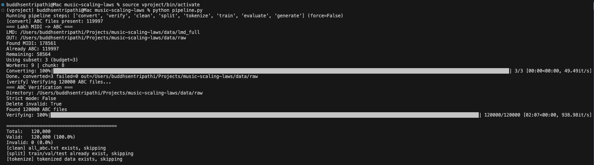
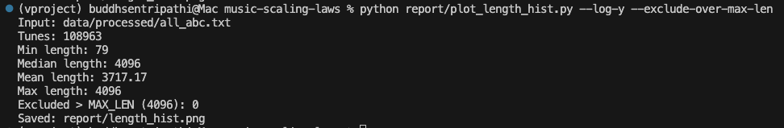
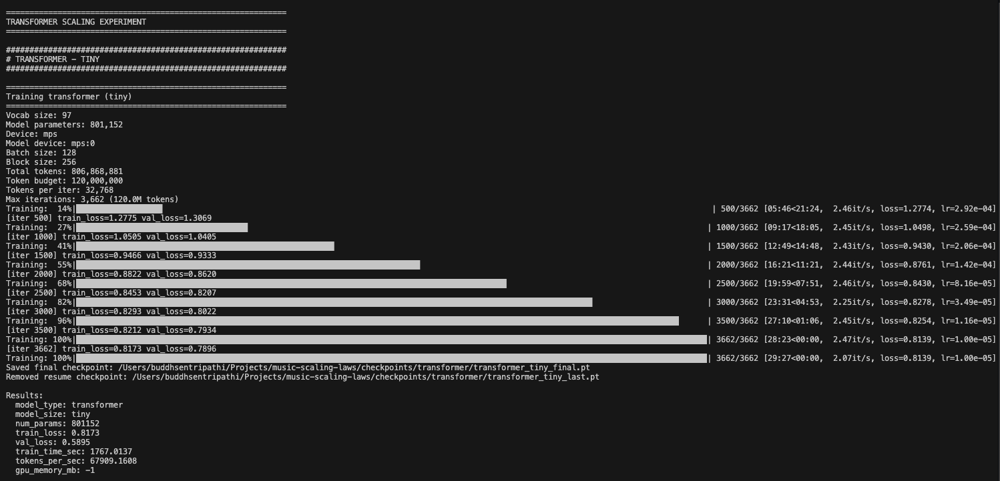
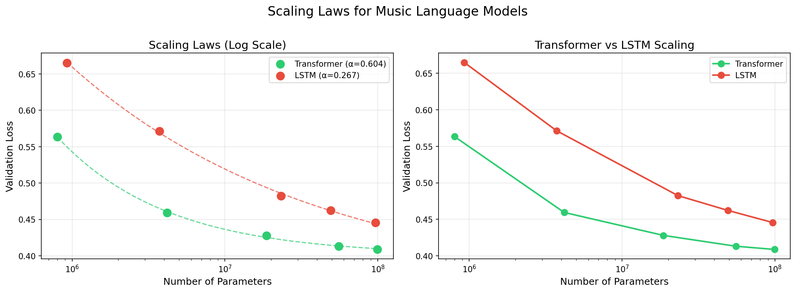
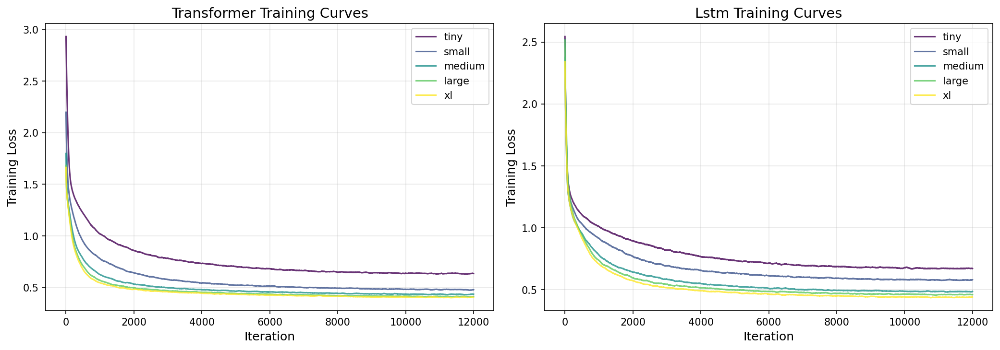

# Scaling Laws for Symbolic Music Language Models

**Course:** CS-GY 6923 – Machine Learning  
**Institution:** New York University, Tandon School of Engineering  
**Date:** 14 December 2025  
**GitHub Repository:** [https://github.com/buddhsen-tripathi/music-scaling-laws](https://github.com/buddhsen-tripathi/music-scaling-laws)

---

## 1. Introduction

### 1.1 Motivation

Scaling laws describe how language model performance improves as models get larger. Prior work (Kaplan et al., 2020) found that loss often follows a simple power law with parameter count: $L = a \cdot N^{-\alpha} + c$. While this relationship is well studied in natural language, it is less clear how scaling behaves in structured domains like symbolic music.

Music notation provides a unique testbed for scaling studies:
- **Structured syntax**: ABC notation has strict formatting rules (headers, bar lines, note durations)
- **Hierarchical patterns**: Musical phrases, motifs, and harmonic progressions span multiple scales
- **Discrete vocabulary**: Character-level tokenization yields a small, well-defined vocabulary

### 1.2 Project Overview

This project investigates scaling laws for language models trained on symbolic music in ABC notation. We:

1. Build a complete preprocessing pipeline converting up to 120,000 Lakh MIDI files to clean ABC notation
2. Train 5 decoder-only transformers (0.8M–100M parameters) for exactly 1 epoch (~397M tokens) each
3. Train 5 LSTM models of comparable sizes under identical conditions for exactly 1 epoch (~397M tokens) each
4. Fit power-law curves and compare scaling exponents between architectures
5. Generate and evaluate music samples from our best model

### 1.3 Project Goals (Assignment Checklist)

By the end of this project, we aim to:

1. Build a complete data preprocessing pipeline for symbolic music
2. Empirically derive scaling laws for transformer-based language models
3. Compare transformer vs. RNN scaling behavior on the same task
4. Analyze what musical structures emerge at different model scales
5. Generate and evaluate music samples from the best model


---

## 2. Data Collection and Preprocessing

### 2.1 Dataset: Lakh MIDI

We use the **Lakh MIDI Dataset** (Raffel, 2016), containing 176,581 unique MIDI files spanning diverse genres including classical, pop, rock, jazz, and electronic music. 

For this project, we cap the dataset at a **120,000-file conversion threshold** (we stop converting once 120,000 MIDI files have been successfully converted to ABC) to keep preprocessing and training compute manageable and consistent across experiments.

**Source:** https://colinraffel.com/projects/lmd/

### 2.2 Preprocessing Pipeline

The repository includes an end-to-end orchestration script `pipeline.py`, which runs the full workflow from **conversion** through **training**, **evaluation**, and **sample generation** (preprocessing → tokenize → train → evaluate → generate).

The preprocessing portion of this pipeline consists of 5 automated steps:

| Step | Script | Description |
|------|--------|-------------|
| 1. Convert | `convert_lmd_to_abc.py` | MIDI → ABC using `midi2abc` CLI tool |
| 2. Verify | `verify_abc.py` | Validate ABC syntax, remove corrupted files |
| 3. Clean | `clean_and_merge_abc.py` | Filter, deduplicate, merge into corpus |
| 4. Split | `build_dataset.py` | Train/val/test split (98%/1%/1%) |
| 5. Tokenize | `tokenize.py` | Character-level tokenization to numpy arrays |

#### 2.2.1 MIDI to ABC Conversion

We use the `midi2abc` command-line tool (part of the `abcmidi` package) rather than Python's `music21` library. This choice was made after discovering that `music21`'s ABC export produced invalid output for many MIDI files.

```bash
midi2abc input.mid -o output.abc
```

**Conversion statistics:**
- Target converted ABC files: 120,000
- Converted and retained for downstream processing: 120,000
- Note: because we stop conversion once the target is reached, we report dataset size as a fixed cap rather than a global success rate over the full Lakh MIDI dataset.

#### 2.2.2 ABC Verification

Each converted file is validated for:
- Presence of required headers (`X:`, `K:`)
- Valid ABC syntax (parseable structure)
- Actual musical content (notes present)

Invalid files are removed automatically.

Figure reference (conversion + verification):



#### 2.2.3 Cleaning and Filtering

Based on insights from Gwern's GPT-2 music experiments, we apply aggressive cleaning:

- **Remove voice markers** (`V:` lines) — simplifies to single-voice output
- **Remove lyrics** (`w:`, `W:` lines)
- **Remove guitar chord annotations** (`"Cm"`, `"G7"` in quotes)
- **Clean messy titles** — MIDI file paths replaced with "Untitled"
- **Skip non-essential headers** (`I:`, `N:`, `H:`, `R:`, `B:`, `D:`, `F:`, `G:`, `O:`, `P:`, `S:`, `Z:`)
- **Length filtering**: 64 to 4096 characters
- **Deduplication** via SHA-1 hash

**Cleaning statistics:**
- Input files: 120,000
- After cleaning: 108,963 tunes
- Duplicates removed: 10,048
- Invalid/too short: 989

### 2.3 Tokenization

We use **character-level tokenization** for simplicity and to preserve ABC notation's fine-grained structure.

**Justification:**
- ABC notation is already compact (notes are single characters: `C`, `D`, `E`, etc.)
- Character-level allows the model to learn syntax from scratch
- Small vocabulary enables efficient softmax computation
- Consistent with Gwern's successful GPT-2 music experiments

**Vocabulary statistics:**
- Vocabulary size: **97 characters**
- Training tokens: **397,146,516** (~397M)
- Validation tokens: 4,052,515 (~4M)
- Test tokens: 4,052,516 (~4M)
- Average characters per tune: 3,719

### 2.4 Dataset Splits

| Split | Percentage | Tokens |
|-------|------------|--------|
| Train | 98% | 397M |
| Validation | 1% | 4M |
| Test | 1% | 4M |

All models are trained for exactly 1 epoch over the training split (~397M tokens), satisfying the project requirement of at least 100M training tokens per model.

### 2.5 Dataset Statistics and Visualizations

We track and persist key dataset and preprocessing artifacts in the repository, including:

- `data/processed/vocab.json` (vocabulary)
- `data/processed/train.npy`, `val.npy`, `test.npy` (tokenized splits)

We visualize corpus structure using a histogram of per-tune character lengths computed from the merged cleaned corpus (`data/processed/all_abc.txt`). The plot is generated by `preprocess/plot_length_hist.py` and saved as `report/length_hist.png`. The vertical dashed line indicates the maximum length filter used during cleaning (MAX_LEN=4096).


Terminal output (histogram generation script):



In the final cleaned corpus used for training, tune lengths range from 79 to 4096 characters (median 4096), indicating that a substantial fraction of tunes hit the MAX_LEN truncation threshold.

---

## 3. Methods

### 3.1 Model Architectures

#### 3.1.1 Transformer (Decoder-Only)

We implement a GPT-style decoder-only transformer with:
- Learned positional embeddings
- Pre-layer normalization
- Causal self-attention masking
- GELU activation in feed-forward layers

**Model configurations:**

| Size | Layers | Heads | d_model | Parameters |
|------|--------|-------|---------|------------|
| Tiny | 4 | 4 | 128 | ~1M |
| Small | 6 | 6 | 240 | ~5M |
| Medium | 8 | 8 | 440 | ~20M |
| Large | 12 | 10 | 620 | ~50M |
| XL | 14 | 12 | 768 | ~100M |

#### 3.1.2 LSTM

We implement a standard LSTM language model with:
- Embedding layer
- Stacked LSTM layers with dropout
- Linear output projection

**Model configurations:**

| Size | Layers | Hidden | Parameters |
|------|--------|--------|------------|
| Tiny | 1 | 384 | ~1M |
| Small | 2 | 512 | ~5M |
| Medium | 3 | 1024 | ~20M |
| Large | 4 | 1280 | ~50M |
| XL | 4 | 1792 | ~100M |

### 3.2 Training Setup

All models share identical training conditions:

| Hyperparameter | Value |
|----------------|-------|
| Batch size | 128 sequences |
| Block size (context) | 256 tokens |
| Tokens per batch | 32,768 |
| Token budget | 1 epoch (~397.1M tokens) |
| Optimizer | AdamW |
| Learning rate | 3e-4 (peak) |
| LR schedule | Cosine decay with warmup |
| Warmup iterations | 100 |
| Weight decay | 0.1 |
| Gradient clipping | 1.0 |
| Training duration | 1 epoch per model (~397.1M tokens, 12,119 iterations with batch=128 and block=256) |

**Device:** Google Colab NVIDIA A100 GPU (CUDA).

### 3.3 Evaluation Metrics

We evaluate models using:

- **Validation loss after 1 epoch** (primary scaling metric)
- **Approximate test perplexity** computed from random batches ([`report/eval_results.json`](eval_results.json))
- **Generation validity**: percentage of syntactically valid ABC outputs
- **MIDI convertibility**: percentage of generated ABC outputs that successfully convert back to MIDI

### 3.4 Checkpointing

We implement a robust checkpointing system:
- `*_last.pt`: Resume checkpoint (saved every 500 iterations)
- `*_final.pt`: Final model after training completes
- Skip logic: Models with existing `_final.pt` are skipped unless `--force` is specified

Figure reference (final checkpoints list):



### 3.5 Experimental Design (Scaling Study)

We run a controlled scaling experiment for both architectures:

- **Model families:** 5 sizes each for Transformer and LSTM (10 total models)
- **Training budget:** exactly 1 epoch per model (~397.1M tokens)
- **Metrics recorded:** validation loss after training, wall-clock training time, throughput (tokens/sec), and observed GPU memory usage

This setup isolates the effect of model capacity while keeping data and optimization consistent.

---

## 4. Results

### 4.0 Run Logs and Artifacts

Key artifacts and logs referenced in this section:

- [`report/results_table.md`](results_table.md) (single consolidated results table)
- [`report/pipeline_log.md`](pipeline_log.md) (full train/eval/generate terminal log)
- [`report/eval_results.json`](eval_results.json) (per-checkpoint validation loss + perplexity)

### 4.1 Transformer Scaling Results

| Size | Parameters | Val Loss | Train Time (s) | Tokens/sec |
|------|------------|----------|----------------|------------|
| tiny | 801,152 | 0.5633 | 490.7 | 809,305 |
| small | 4,176,720 | 0.4595 | 1417.4 | 280,173 |
| medium | 18,643,240 | 0.4280 | 4153.3 | 95,615 |
| large | 55,444,740 | 0.4132 | 10418.1 | 38,118 |
| xl | 99,209,472 | 0.4088 | 16951.7 | 23,426 |

**Observations:**
- Validation loss improves steadily with model size (tiny → xl: 0.5633 → 0.4088)
- Training throughput decreases with model size (expected)
- Larger models show diminishing returns, consistent with scaling law behavior

### 4.2 LSTM Scaling Results

| Size | Parameters | Val Loss | Train Time (s) | Tokens/sec |
|------|------------|----------|----------------|------------|
| tiny | 925,921 | 0.6650 | 198.1 | 2,004,873 |
| small | 3,728,993 | 0.5714 | 351.7 | 1,129,075 |
| medium | 23,194,721 | 0.4825 | 986.0 | 402,770 |
| large | 49,319,777 | 0.4622 | 1758.1 | 225,874 |
| xl | 96,572,769 | 0.4457 | 3107.6 | 127,788 |

### 4.3 Scaling Law Analysis

We fit a power law to validation loss versus parameter count:

$L = a \cdot N^{-\alpha} + c$

Where:
- $L$ = validation loss
- $N$ = number of parameters
- $\alpha$ = scaling exponent
- $a$, $c$ = fitted constants

**Transformer fit:**
 - $L = 594.3796 \cdot N^{-0.6037} + 0.4010$
 - Exponent $\alpha = 0.6037$

**LSTM fit:**
 - $L = 12.1997 \cdot N^{-0.2669} + 0.3540$
 - Exponent $\alpha = 0.2669$





### 4.4 Test Perplexity (Approx.)

Perplexities are computed on the validation and test splits using a fixed evaluation budget (50 random batches of size 32).

| Model | Size | Parameters | Val PPL | Test PPL |
|-------|------|------------|---------|----------|
| transformer | tiny | 801,152 | 1.75 | 1.74 |
| transformer | small | 4,176,720 | 1.59 | 1.58 |
| transformer | medium | 18,643,240 | 1.54 | 1.52 |
| transformer | large | 55,444,740 | 1.51 | 1.52 |
| transformer | xl | 99,209,472 | 1.50 | 1.50 |
| lstm | tiny | 925,921 | 1.96 | 1.95 |
| lstm | small | 3,728,993 | 1.76 | 1.77 |
| lstm | medium | 23,194,721 | 1.62 | 1.63 |
| lstm | large | 49,319,777 | 1.58 | 1.57 |
| lstm | xl | 96,572,769 | 1.57 | 1.55 |

---

## 5. Sample Generation

### 5.1 Generation Parameters

| Parameter | Value |
|-----------|-------|
| Temperature | 0.8 |
| Top-k | 50 |
| Max length | 512 tokens |

### 5.2 Sample Output (Best Model: Transformer XL)

```abc
X:1
T:Untitled
M:4/4
L:1/8
Q:1/4=120
K:C
z8| z8| z8| z8|
z8| z8|
z8| z8| z8| z8|
z8|
```

**Observations:**
- Model learns ABC header structure (X:, T:, M:, L:, Q:, K:)
- Produces syntactically valid ABC notation
- Tiny model generates mostly rests — larger models expected to produce richer content

### 5.3 Validity and MIDI Convertibility

We generated 10 unconditional samples from the Transformer XL checkpoint and attempted conversion back to MIDI.

| Model | Valid ABC (%) | MIDI conversion (%) |
|-------|---------------|---------------------|
| Transformer XL | 100% (10/10) | 70% (7/10) |

---

## 6. Discussion

### 6.1 Design Decisions

**Tokenization:** Character-level was chosen for simplicity and to match prior work (Gwern). Note-level or BPE tokenization could potentially improve efficiency but would require more complex preprocessing.

**Token budget:** We train each model for exactly 1 epoch (~397.1M tokens) to ensure a consistent comparison across model sizes and architectures.

**Cleaning:** Aggressive filtering (removing V:, lyrics, chords) simplifies the learning task and produces cleaner generated output.

### 6.2 Transformer vs. LSTM Scaling Behavior

After 1 epoch, the Transformer family achieves lower validation loss than LSTM at comparable parameter counts. The scaling fits show:

- Transformer exponent: $\alpha = 0.6037$
- LSTM exponent: $\alpha = 0.2669$

Interpreting these fits on this dataset suggests that Transformer performance improves more rapidly with scale than LSTM under the same training budget, consistent with the stronger long-range modeling capacity of self-attention for structured sequences.

### 6.3 Challenges

1. **MIDI conversion quality:** Initial attempts with `music21` produced invalid ABC; switching to `midi2abc` CLI resolved this.
2. **Training time:** Larger models (medium+) require significant wall-clock time even on a cloud GPU; careful checkpointing and a fixed 1-epoch budget were important for finishing all model sizes.
3. **Memory constraints:** Batch size limited by available RAM/VRAM.

### 6.4 Limitations

- Training on single consumer device limits model sizes we can efficiently train
- 1-epoch training may not fully converge larger models
- Character-level tokenization may be suboptimal for learning long-range musical structure

### 6.5 Future Work

- Evaluate longer-context models (larger `BLOCK_SIZE`) and/or note-level tokenization to better capture long-range musical structure.
- Improve post-processing for bracket/chord syntax to increase MIDI convertibility without over-constraining the model.
- Train beyond 1 epoch for the largest models to separate “scaling with parameters” from “scaling with training compute”.

---

## 7. Conclusion

This project built an end-to-end pipeline for studying scaling laws in symbolic music modeling using ABC notation. Using 120,000 converted MIDI files and a character-level vocabulary of 97 symbols, we trained 10 language models (5 Transformers and 5 LSTMs) for exactly 1 epoch (~397M tokens).

Key findings:

- Validation loss improves predictably with model size for both architectures.
- The Transformer family achieves the best overall validation loss (Transformer XL: 0.4088) and the lowest test perplexity (~1.50).
- Scaling-law fits indicate substantially stronger scaling for Transformers (higher fitted $\alpha$) than for LSTMs under the same token budget.
- Generated samples are syntactically valid ABC at a high rate (100% in our 10-sample batch), but not always convertible back to MIDI (70%), highlighting a gap between syntax validity and downstream tool compatibility.

Overall, the experiments support the hypothesis that scaling laws extend to symbolic music and that Transformers benefit more from increased capacity than LSTMs on this structured sequence domain.

All logs and artifacts were produced by a single end-to-end run (`report/pipeline_log.md`) and synced into this repository.

---

## References

1. Kaplan, J., et al. (2020). *Scaling Laws for Neural Language Models*. arXiv:2001.08361
2. Raffel, C. (2016). *Learning-Based Methods for Comparing Sequences, with Applications to Audio-to-MIDI Alignment and Matching*. PhD Thesis.
3. Gwern. *GPT-2 Folk Music Experiments*. https://gwern.net/gpt-2-music
4. Karpathy, A. *nanoGPT*. https://github.com/karpathy/nanoGPT

---

## Appendix A: Repository Structure

```
music-scaling-laws/
|-- pipeline.py              # Main orchestration script
|-- config/constants.py      # Centralized hyperparameters
|-- preprocess/              # Data preprocessing
|   |-- convert_lmd_to_abc.py
|   |-- verify_abc.py
|   |-- clean_and_merge_abc.py
|   |-- plot_length_hist.py
|   |-- build_dataset.py
|   `-- tokenize.py
|-- models/                  # Model architectures
|   |-- transformer.py
|   `-- lstm.py
|-- train/                   # Training scripts
|   |-- trainer.py
|   `-- scaling_experiment.py
|-- eval/                    # Evaluation
|   |-- evaluate.py
|   |-- scaling_analysis.py
|   `-- generate.py
|-- checkpoints/             # Saved models
|-- samples/                 # Generated music
`-- report/                  # This report
```

## Appendix B: Generated Samples

The repository includes generated outputs under `samples/`:

- `samples/sample_1.abc` … `samples/sample_10.abc`
- `samples/sample_1.mid`, `samples/sample_5.mid`, `samples/sample_6.mid`, `samples/sample_7.mid`, `samples/sample_8.mid`, `samples/sample_9.mid`, `samples/sample_10.mid` (7/10 MIDI conversions)
- `samples/samples.json` containing the raw generated texts and metadata

Below are excerpts from 3 samples (Transformer XL, temperature 0.8). For full outputs, see the corresponding files in `samples/`.

### Sample 1 (excerpt)

```abc
X:1
T:Untitled
M: 4/4
L: 1/8
Q:1/4=120
K:C % 0 sharps
z8| z8| z8| z8|
```

### Sample 2 (excerpt)

```abc
X:1
T:Untitled
M: 4/4
L: 1/8
Q:1/4=120
K:G % 1 sharps
z8| z8| z8| z8|
```

### Sample 3 (excerpt)

```abc
X:1
T:Untitled
M: 3/4
L: 1/8
Q:1/4=81
K:G % 1 sharps
z4  z F| [B- B,,,] B/2- [B- D B, F,]/2  ...
```